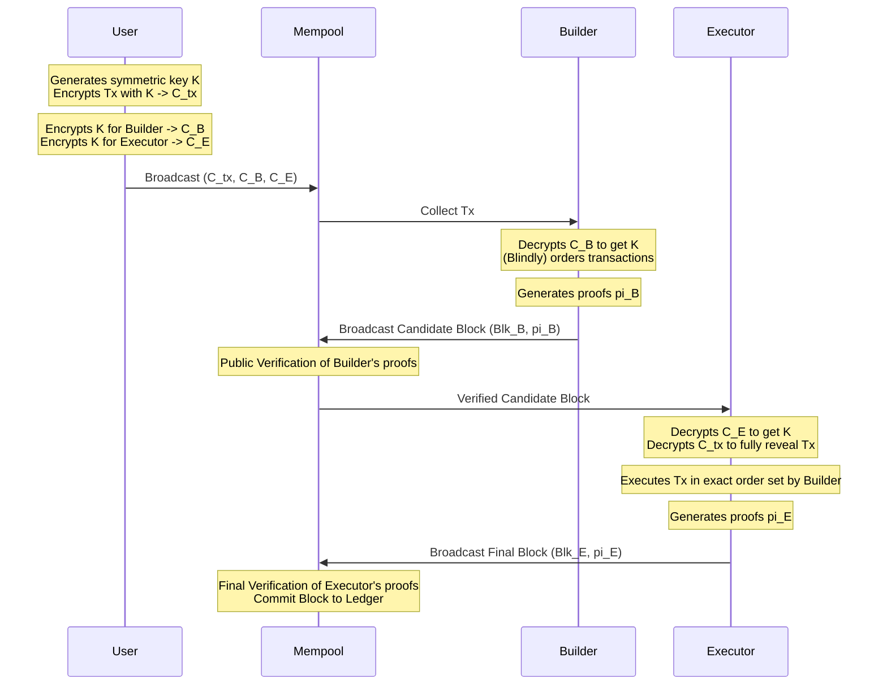

# Mitigating-MEV-Attacks-with-a-Two-Tiered-Architecture-Utilizing-Verifiable-Decryption

Mitigating MEV Attacks with a Two-Tiered Architecture  Utilizing Verifiable Decryption

This repository contains the Python implementation files used for the proposal model in the manuscript titled "Mitigating MEV Attacks with a Two-Tiered Architecture Utilizing Verifiable Decryption".

## Research Use Notice

Please note that the code and experiments provided in this repository are intended for research purposes only. They have not been fully validated and should be used with caution. Users are encouraged to review the code and test it further before applying it in production environments.

## Python Implementation Files

- Algorithm Implementation.py: Contains the main algorithm implementation.
- Case1_multiple.py: Implementation for Case 1 with multiple scenarios.
- Case1_multiple_updates_1000.py: Implementation for Case 1 with multiple scenarios and 1000 updates.
- Case2_multiple.py: Implementation for Case 2 with multiple scenarios.
- Case3_Multiple.py: Implementation for Case 3 with multiple scenarios.
- Case3_Multiple_updates_1000.py: Implementation for Case 3 with multiple scenarios and 1000 updates.
- Case4_Multiple.py: Implementation for Case 4 with multiple scenarios.
- Statistics Matrix.py: Implementation for Statistics Matrix.
- Probability Rate of MEV attacks.py Implementation for statistical analysis.

## Description

These files contain the necessary code to replicate the experiments and results presented in our manuscript. Each file corresponds to different cases and scenarios we analyzed during our research.

## Two-Tier Protocol Architecture

The algorithm operates on a "commit-and-reveal" or verifiable decryption approach.



## Benchmark Results

Below are the benchmark results of simulating the **Two-Tier MEV-Resistant Block Construction Protocol** with 1000 transactions.

```text
===================================================================
   Benchmarking Protocol with 1000 Transactions               
===================================================================

Benchmark Results (Average time per transaction over 1000 runs):
  User Phase (Encryption)         : 2.095 ms
  Builder Phase (Decryption/Proof): 46.521 ms
  Public Verification (Proof check): 0.000 ms
  Executor Phase (Full Decryption): 46.671 ms
  Final Verification (Proof check) : 0.000 ms
  ------------------------------------------------
  Total Protocol Overhead per Tx   : 95.287 ms
```
