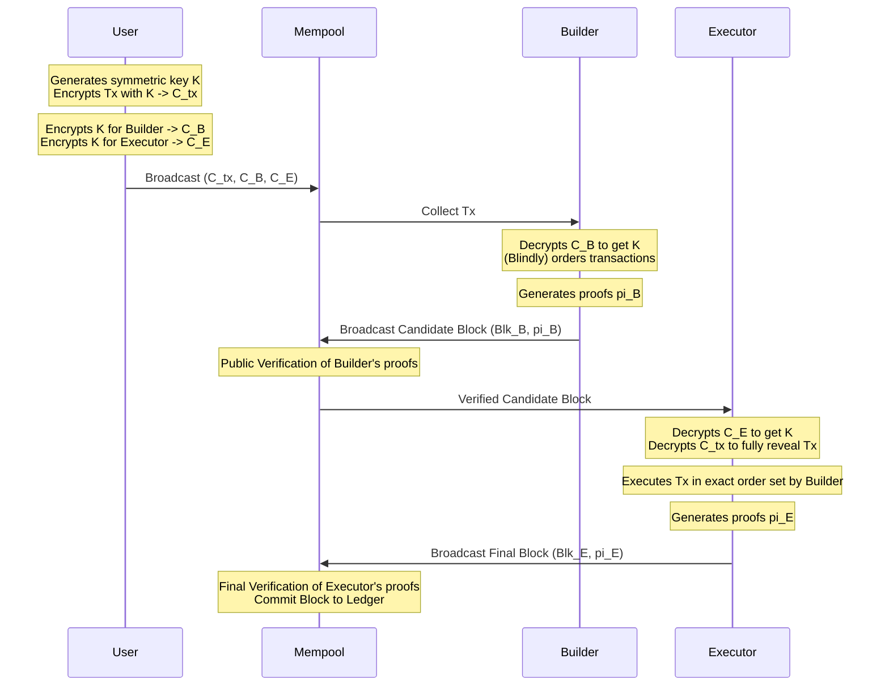

# Mitigating-MEV-Attacks-with-a-Two-Tiered-Architecture-Utilizing-Verifiable-Decryption

Mitigating MEV Attacks with a Two-Tiered Architecture  Utilizing Verifiable Decryption

This repository contains the Python implementation files used for the proposal model in the manuscript titled "Mitigating MEV Attacks with a Two-Tiered Architecture Utilizing Verifiable Decryption". This algorithm implements the paper published at: [Springer: Mitigating MEV attacks with a two-tiered architecture utilizing verifiable decryption](https://link.springer.com/article/10.1186/s13638-024-02390-4).

## Abstract & Protocol Formulation

A distributed ledger is a shared and synchronized database across multiple nodes. However, these nodes (miners/validators) can be compromised to extract Maximal Extractable Value (MEV) by selectively including, excluding, or reordering user transactions.

To address this, the protocol implements a **Two-Tiered Architecture Utilizing Verifiable Decryption** separating block creation (Builders) from block execution (Executors). The protocol is formalized as follows:

### 1. Setup Phase

* **Key Generation:** The network establishes public/private key pairs for the Builder and Executor using RSA-2048.
  * Builder: $(pk_B, sk_B) \leftarrow \text{KeyGen}(1^\lambda)$
  * Executor: $(pk_E, sk_E) \leftarrow \text{KeyGen}(1^\lambda)$

### 2. User Phase (Transaction Encryption)

* A user wishes to submit a transaction $tx$.
* **Symmetric Key Generation:** The user generates a random symmetric key $K \leftarrow \{0, 1\}^{256}$.
* **Payload Encryption:** The user encrypts $tx$ using an authenticated encryption scheme (e.g., AES-EAX) to obtain the ciphertext, authentication tag, and nonce: $(C_{tx}, tag, nonce) \leftarrow \text{Enc}_K(tx)$.
* **Key Encapsulation:** The user encrypts the symmetric key $K$ for both the Builder and the Executor using their respective public keys via PKCS#1 OAEP:
  * $C_B \leftarrow \text{Enc}_{pk_B}(K)$
  * $C_E \leftarrow \text{Enc}_{pk_E}(K)$
* **Broadcast:** The user broadcasts the tuple $(C_{tx}, C_B, C_E)$ to the public Mempool.

### 3. Builder Phase (Decryption & Ordering)

* The Builder collects encrypted transactions from the Mempool.
* **Decryption:** The Builder decrypts $C_B$ using their private key to recover the symmetric key: $K \leftarrow \text{Dec}_{sk_B}(C_B)$.
* **Verification & Ordering:** The Builder computes hashes or zero-knowledge proofs demonstrating the integrity of the ciphertext without fully decrypting or executing the transaction payload. They construct a Candidate Block $Blk_B$ with a fixed transaction order.
* **Proof Generation:** The Builder generates a verifiable decryption proof $\pi_B$.
* **Broadcast:** The Builder broadcasts the Candidate Block and proofs $(Blk_B, \pi_B)$.

### 4. Public Verification Phase

* The community (nodes/validators) verifies the Builder's proof $\pi_B$. If $\text{Verify}(Blk_B, \pi_B) == \text{True}$, the block proceeds; otherwise, the Builder is penalized.

### 5. Executor Phase (Decryption & Execution)

* The Executor receives the verified Candidate Block $Blk_B$.
* **Decryption:** The Executor decrypts $C_E$ using their private key to recover the symmetric key: $K \leftarrow \text{Dec}_{sk_E}(C_E)$.
* **Transaction Recovery:** The Executor decrypts the payload to reveal the raw transaction: $tx \leftarrow \text{Dec}_K(C_{tx}, tag, nonce)$.
* **Execution:** The Executor executes the transactions $tx_i$ in the *exact* sequence dictated by $Blk_B$.
* **Proof Generation:** The Executor generates a state transition and verifiable decryption proof $\pi_E$.
* **Broadcast:** The Executor broadcasts the Final Block and proofs $(Blk_E, \pi_E)$.

### 6. Final Verification Phase

* The network verifies the Executor's proofs $\pi_E$. If valid, $Blk_E$ is permanently committed to the ledger.

## Research Use Notice

Please note that the code and experiments provided in this repository are intended for research purposes only. They have not been fully validated and should be used with caution. Users are encouraged to review the code and test it further before applying it in production environments.

## Python Implementation Files

* `Algorithm Implementation.py`: Contains the main core algorithm implementation.
* `benchmark_base_encryption.py`: Base encryption benchmarks for User, Builder, and Executor key exchanges. Evaluates encryption and decryption latencies.
* `benchmark_builder_tampering.py`: Evaluates scenarios where the Builder acts maliciously and tempers with the transaction ciphertext.
* `benchmark_executor_tampering.py`: Evaluates scenarios where the Executor tampers with the original transaction data.
* `benchmark_community_verification.py`: Measures overhead on verifying builder/executor validity based on cryptographic hashes.
* `local_eth_utils.py`: Contains standard EIP-1559 Raw Ethereum Transaction generation utilities used across all benchmarks.
* `Statistics Matrix.py`: Implementation for statistical analysis and metrics.
* `Probability Rate of MEV attacks.py`: Implementation focusing on the statistical probability of succeeding in an MEV attack scenario.

## Description

These files contain the necessary code to replicate the experiments and results presented in our manuscript. Each file corresponds to different cases and scenarios we analyzed during our research.

## Two-Tier Protocol Architecture

The algorithm operates on a "commit-and-reveal" or verifiable decryption approach.



## Benchmark Results

Below are the single-execution benchmark results of simulating the **Two-Tier MEV-Resistant Block Construction Protocol** with a randomly generated standard Raw Ethereum Transaction.

In addition to timing, the protocols tracked the EVM `Ciphertext Payload` per transaction which evaluates to exactly **661-693 bytes** overhead given AES-EAX and RSA-2048 parameters. Storing this equivalent overhead as `Calldata` during transaction initiation on mainnet would cost theoretically ~`10492-11064 gas`.

```text
===================================================================
   Benchmarking Protocol with 1 RAW ETH Transaction       
===================================================================

[*] Generating 1 signed raw Ethereum transaction...
Benchmark Results (Time for 1 transaction execution):
  User Phase (Encryption)         : 3.026 ms
  Builder Phase (Decryption/Proof): 40.618 ms
  Public Verification (Proof check): 0.000 ms
  Executor Phase (Full Decryption): 41.565 ms
  Final Verification (Proof check) : 0.000 ms
  ------------------------------------------------
  Total Protocol Latency           : 85.209 ms

[*] Original Tx Size    : 117 bytes
[*] Ciphertext Payload  : 661 bytes
[*] Overall Calldata Gas: 10492 gas
===================================================================

===================================================================
              Benchmark: Base Encryption Latency                   
===================================================================

[*] Transaction encryption and integrity check executed.
[*] Original Tx Size  : 117 bytes
[*] Ciphertext Size   : 693 bytes
[*] Encryption Time   : 7.302 ms
[*] Decryption Time   : 4.084 ms
[*] Integrity Passed  : True

[*] Theoretical Gas Cost Overhead (Calldata): 11064 gas
===================================================================

===================================================================
              Benchmark: Builder Tampering Detection               
===================================================================

[*] Tampering detection checked.
[*] Tampering Detected : True
[*] Integrity Passed   : False
[*] Overall Execution  : 844.421 ms
[*] Tamper Check Time  : 844.421 ms
[*] Original Tx Size   : 117 bytes
[*] Ciphertext Size    : 693 bytes

[*] Theoretical Gas Cost Overhead (Calldata): 11004 gas
===================================================================

===================================================================
              Benchmark: Executor Tampering Detection              
===================================================================

[*] Tampering detection checked.
[*] Result Message     : Tampering not detected
[*] Integrity Passed   : False
[*] Encryption Time    : 9.518 ms
[*] Tamper Action Time : 0.000 ms
[*] Integrity Time     : 0.000 ms
[*] Original Tx Size   : 117 bytes
[*] Ciphertext Size    : 693 bytes

[*] Theoretical Gas Cost Overhead (Calldata): 11016 gas
===================================================================

===================================================================
              Benchmark: Community Verification Latency            
===================================================================

[*] Community Verification finished.
[*] Builder Verified   : True
[*] Executor Verified  : False
[*] Verification Time  : 0.000 ms
[*] Key Gen Time       : 370.096 ms
[*] Original Tx Size   : 117 bytes
[*] Ciphertext Size    : 661 bytes

[*] Theoretical Gas Cost Overhead (Calldata): 10540 gas
===================================================================
```
